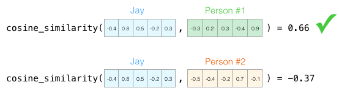
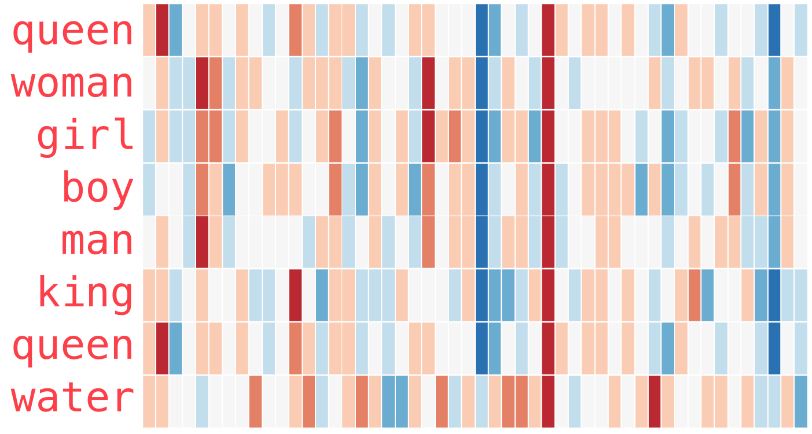

autoscale: true

#[fit] Pipelines
#[fit] Tabular Data
#[fit] Embeddings

---

## Document Similarity

Why might you consider text messages similar?

We denote by $$\bar V(d)$$ the vector derived from document (message) d, with one component in the vector for each dictionary term. The set of documents in a collection then may be viewed as a set of vectors in a vector space, in which there is one axis for each term. 

The similarity between two documents $$d_1$$ and $$d_2$$  can be found by the cosine similarity of their vector representations $$\bar V(d_1)$$ and $$\bar V(d_2)$$:

$$S_{12} = \frac{\bar V(d_1) \cdot \bar V(d_2)}{|\bar V(d_1)| \times |\bar V(d_2)|}$$


---
[.footer: images from http://nlp.stanford.edu/IR-book/]

A collection then is a **term-document** matrix. For example, terms in various "period" novels.

 


Consider the query `q = jealous gossip`. This query turns into the unit vector $$\bar V(q)$$ = (0, 0.707, 0.707). 

**Cosine similarity is the dot product of unit vectors.**

Wuthering Heights is the top-scoring docu- ment for this query with a score of 0.509. 


---
[.footer: Images by [Jay Alammar](http://jalammar.github.io/illustrated-word2vec/)]
[.autoscale: false]

# Embedings: extend the idea


- Observe a bunch of people
- **Infer** Personality traits from them
- Vector of traits is called an **Embedding**
- Who is more similar? Jay and who?
- Use Cosine Similarity of the vectors



---

## Categorical Data

*Example*: 

[Rossmann Kaggle Competition](https://www.kaggle.com/c/rossmann-store-sales). Rossmann is a 3000 store European Drug Store Chain. The idea is to predict sales 6 weeks in advance.

Consider `store_id` as an example. This is a **categorical** predictor, i.e. values come from a finite set. 

We usually **one-hot encode** this: a single store is a length 3000 bit-vector with one bit flipped on.

---

## What is the problem with this?

- The 3000 stores have commonalities, but the one-hot encoding does not represent this
- Indeed the dot-product (cosine similarity) of any-2 1-hot bitmaps must be 0
- Would be useful to learn a lower-dimensional **embedding** for the purpose of sales prediction.
- These store "personalities" could then be used in other models (different from the model used to learn the embedding) for sales prediction
- The embedding can be also used for other **tasks**, such as employee turnover prediction

---
[.footer: Image from  [Guo and Berkhahn](https://arxiv.org/abs/1604.06737)]

## Training an Embedding

- Normally you would do a linear or MLP regression with sales as the target, and both continuous and categorical features
- The game is to replace the 1-hot encoded categorical features by "lower-width" embedding features, for *each* categorical predictor
- This is equivalent to considering a neural network with the output of an additional **Embedding Layer** concatenated in
- The Embedding layer is simply a linear regression 


---

## Training an embedding (contd)

A 1-hot vector for a categorical variable $$v$$ with cardinality $$N(v)$$ can be written using the Kronecker Delta symbol as

$$ v_k = \delta_{jk}, j \in \{1..N(v)\} $$

Then an embedding of width (dimension) $$L$$ is just a $$ N(v) \times L$$ matrix of weights $$W_{ij}$$ such that multiplying the kth 1-hot vector by this weight matrix by picks out the kth row of weights (see right)

But how do we find these weights? We fit for them with the rest of the weights in the MLP!


---
[.code-highlight: all]
[.code-highlight: 6]
[.code-highlight: 12]
[.code-highlight: 13-17]
[.code-highlight: all]

```python
def build_keras_model():
    input_cat = []
    output_embeddings = []
    for k in cat_vars+nacols_cat: #categoricals plus NA booleans
        input_1d = Input(shape=(1,))
        output_1d = Embedding(input_cardinality[k], embedding_cardinality[k], name='{}_embedding'.format(k))(input_1d)
        output = Reshape(target_shape=(embedding_cardinality[k],))(output_1d)
        input_cat.append(input_1d)
        output_embeddings.append(output)

    main_input = Input(shape=(len(cont_vars),), name='main_input')
    output_model = Concatenate()([main_input, *output_embeddings])
    output_model = Dense(1000, kernel_initializer="uniform")(output_model)
    output_model = Activation('relu')(output_model)
    output_model = Dense(500, kernel_initializer="uniform")(output_model)
    output_model = Activation('relu')(output_model)
    output_model = Dense(1)(output_model)

    kmodel = KerasModel(
        inputs=[*input_cat, main_input], 
        outputs=output_model    
    )
    kmodel.compile(loss='mean_squared_error', optimizer='adam')
    return kmodel

def fitmodel(kmodel, Xtr, ytr, Xval, yval, epochs, bs):
    h = kmodel.fit(Xtr, ytr, validation_data=(Xval, yval),
                       epochs=epochs, batch_size=bs)
    return h
```

---

## Another Example: Recommendation Systems

We want to make a recommendation (on, say, a 1-5 scale) for an item $$m$$ by a user $$u$$.

We can write this as: $$Y_{um} = Y_{um}^{baseline}$$

where $$  Y_{um}^{baseline} =  \mu +  \bar \theta \cdot I_{u} +  \bar \gamma \cdot I_{m} $$

where the unknown parameters $$\theta_{u}$$ and $$\gamma_{m}$$ indicate the deviations, or biases, of user $$u$$ and item $$m$$, respectively, from some intercept parameter $$\mu$$.


---

Remember this is a sparse problem. Most users have not rated most items. So we will want to regularize. Thus we want to minimize the loss:

$$\sum_{u,m} \left( Y_{um} -  \mu - \bar \theta \cdot I_{u} -  \bar \gamma \cdot I_{m} \right)^2 + \alpha \left( \theta_{u}^2 + \gamma_{m}^2 \right)$$

This is a Ridge Regression, or SGD with weight decay.

The baseline is not enough, though. Lets add a term $$r_{um}$$, the residual left after the biases are taken into account:

$$Y_{um} = Y_{um}^{baseline} + r_{um}.$$

---

## Modeling the Residual

Associate with each item a vector $$\bar q_{m}$$ of length $$L$$. Associate with each user a vector $$\bar p_{u}$$ of length $$L$$.

$$\bar q_{m}$$  measures the extent to which an item(restaurant) possesses $$L$$ latent factors: Low price, spicyness, etc. $$\bar p_{u}$$ captures the extent of interest the user has in restaurants(items) that are high on the corresponding factors (a user who likes spicy food). 

Then we model the residuals as:

$$r_{um} = \bar q_{m}^{T} \cdot \bar p_{u}, $$

the user's overall interest in the item's characteristics.


---

## Embeddings Again

So, we want: $$Y_{um} = \mu +  \bar \theta \cdot I_{u} +  \bar \gamma \cdot I_{m} + \bar q_{m}^{T} \cdot \bar p_{u}$$

To solve this we need to simply minimize the risk of the entire regression, ie

$$\sum_{u,m} \left( Y_{um} -  \mu - \bar \theta \cdot I_{u} -  \bar \gamma \cdot I_{m} - \bar q_{m}^{T} \cdot \bar p_{u} \right)^2 + \alpha \left( \theta_{u}^2 + \gamma_{m}^2 + \|\bar q_{m}\|^{2} + \|\bar p_{u}\|^{2} \right)$$

We have seen the $$\bar q_{m}^{T}$$ and $$\bar p_{u}$$ before! These are simply $$L$$ dimensional item and user specific **embeddings**!! And we'll train the entire model using SGD and weight decay. (The biases can be thought as 1-D embeddings!)

---

## Embedding is just a linear regression

So why are we giving it another name?

- it is usually to a lower dimensional space
- traditionally we have done linear dimensional reduction through PCA or SVD and truncation, but sparsity can throw a spanner into the works
- we train the weights of the embedding regression using SGD, along with the weights of the downstream task (here fitting the rating)
- the embedding can be used for alternate tasks, such as finding the similarity of users.

See how [Spotify](https://www.slideshare.net/AndySloane/machine-learning-spotify-madison-big-data-meetup) does all this..

---

```python
def embedding_input(emb_name, n_items, n_fact=20, l2regularizer=1e-4):
    inp = Input(shape=(1,), dtype='int64', name=emb_name)
    return inp, Embedding(n_items, n_fact, input_length=1, embeddings_regularizer=l2(l2regularizer))(inp)

usr_inp, usr_emb = embedding_input('user_in', n_users, n_fact=50, l2regularizer=1e-4)
mov_inp, mov_emb = embedding_input('movie_in', n_movies, n_fact=50, l2regularizer=1e-4)

def create_bias(inp, n_items):
    x = Embedding(n_items, 1, input_length=1)(inp)
    return Flatten()(x)

usr_bias = create_bias(usr_inp, n_users)
mov_bias = create_bias(mov_inp, n_movies)

def build_dp_bias_recommender(u_in, m_in, u_emb, m_emb, u_bias, m_bias):
    x = dot([u_emb, m_emb], axes=(2,2))
    x = Flatten()(x)
    x = add([x, u_bias])
    x = add([x, m_bias])
    bias_model = Model([u_in, m_in], x)
    bias_model.compile(Adam(0.001), loss='mse')
    return bias_model

bias_model = build_dp_bias_recommender(usr_inp, mov_inp, usr_emb, mov_emb, usr_bias, mov_bias)
```

---
[.footer: images in this section from [Illustrated word2vec](http://jalammar.github.io/illustrated-word2vec/)]

# Word Embeddings

- The Vocabulary $$V$$ of a corpus (large swath of text) can have 10,000 and maybe more words
- a 1-hot encoding is huge, moreover, similarities between words cannot be established
- we map words to a smaller dimensional latent space of size $$L$$ by considering some downstream task to train on
- we hope that the embeddings learnt are useful for other tasks.

---

## Obligatory example

See man->boy as woman->girl, similarities of king and queen, for eg. These are lower dimensional [GloVe embedding](https://nlp.stanford.edu/projects/glove/) vectors




---

## How do we train word embeddings?

We need to choose a downstream task. We could choose **Language Modeling**: predict the next word. We'll start with random "weights" for the embeddings and other parameters and run SGD. A trained model+embeddings would look like this:


---

How do we set up a training set?


Why not look both ways? This leads to the Skip-Gram and CBOW architectures..

---

## SKIP-GRAM: Predict Surrounding Words

Choose a window size (here 4) and construct a dataset by sliding a window across.

 

---

## Usage of word2vec

- the pre-trained word2vec and other embeddings (such as GloVe) are used everywhere in NLP today
- the ideas have been used elsewhere as well. [AirBnB](http://delivery.acm.org/10.1145/3220000/3219885/p311-grbovic.pdf?ip=65.112.10.217&id=3219885&acc=OPENTOC&key=4D4702B0C3E38B35%2E4D4702B0C3E38B35%2E4D4702B0C3E38B35%2E054E54E275136550&__acm__=1554311026_27cfada2bffd4237ba58449ec09cf72b) and [Anghami](https://towardsdatascience.com/using-word2vec-for-music-recommendations-bb9649ac2484) model sequences of listings and songs using word2vec like techniques
- [Alibaba](http://delivery.acm.org/10.1145/3220000/3219869/p839-wang.pdf?ip=66.31.46.87&id=3219869&acc=OPENTOC&key=4D4702B0C3E38B35%2E4D4702B0C3E38B35%2E4D4702B0C3E38B35%2E054E54E275136550&__acm__=1553960802_303235e170b9c82dab21a176f6d72c6f) and [Facebook](https://ai.facebook.com/blog/open-sourcing-pytorch-biggraph-for-faster-embeddings-of-extremely-large-graphs) use word2vec and graph embeddings for recommendations and social network analysis.
